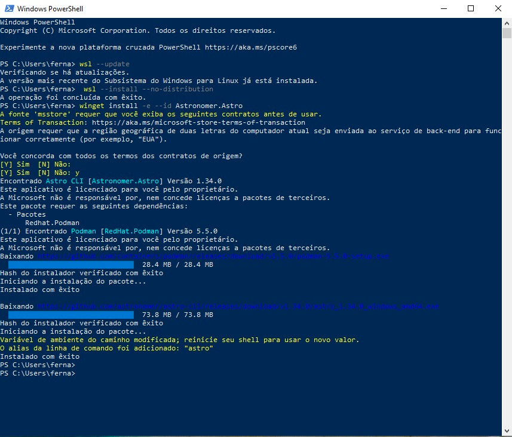
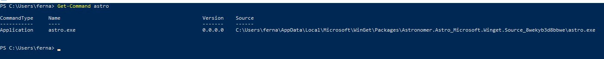
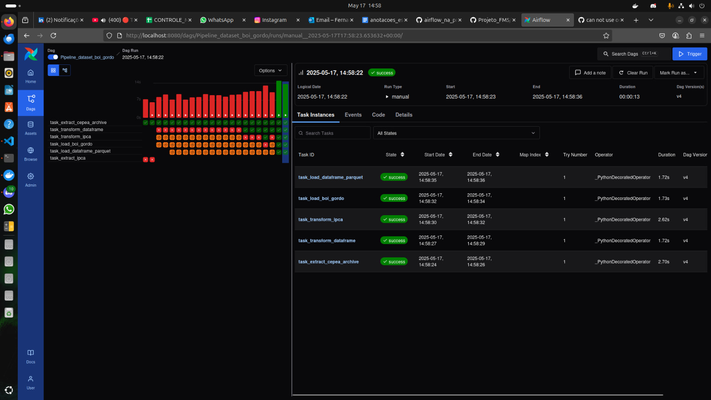
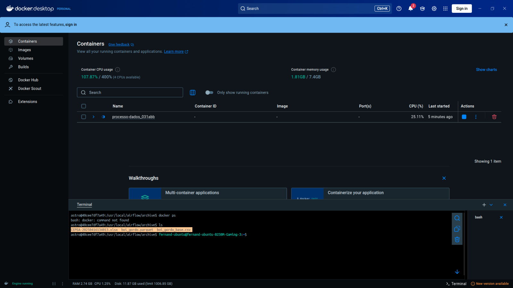
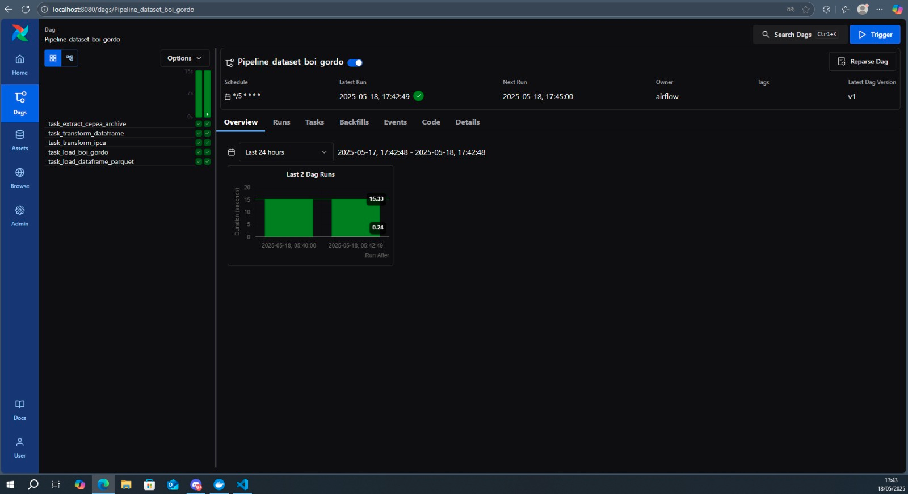
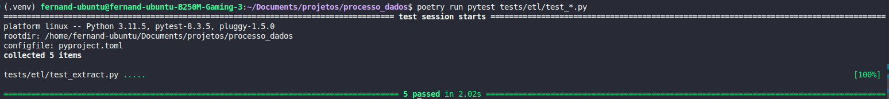

📊 Projeto de Eng de Dados Ponta

Opa bão? 😉

Este projeto tem como objetivo implementar uma pipeline de ETL utilizando Apache Airflow orquestrado via Astronomer, com containers Docker e controle de ambiente virtual via Poetry.

Este projeto foi feito no ambiente linux

🔧 Tecnologias Utilizadas

    - Python 3.11.5
    - Apache Airflow
    - Astronomer CLI
    - Docker
    - Poetry
    - Pytest

⚙️ Execução e Orquestração

Todo o pipeline foi orquestrado com:

    Apache Airflow, utilizando o Astronomer CLI para facilitar a execução local com Docker.

    Docker para conteinerização do ambiente completo (Airflow + dependências).

    Poetry para gestão de dependências e ambiente virtual.

    Pytest para execução de testes unitários garantindo a qualidade das funções críticas.

📦 Como rodar o projeto localmente

    1. Clone o repositório

        - git clone https://github.com/FernandoMS4/projeto_de_dados.git

        - cd projeto_de_dados

        - code .

🚀 Rodando com Astronomer + Docker
    
    1. Instale o Astronomer CLI
        
        > No linux: curl -sSL install.astronomer.io | sudo bash -s  
    
        > Verifique a versão do astronomer: astro version
    
        > Caso esteja no Windows utilize o WSL para configurar o ambiente ou installe seguindo os passos a seguir no Powershell:
            -   wsl --update
            -   wsl --install --no-distribution
            -   winget install -e --id Astronomer.Astro

📁 Adicionando o Astronomer ao PATH

Depois da instalação, o executável astro pode não ser imediatamente reconhecido no terminal. Para corrigir isso:

    Rode o seguinte comando no PowerShell:

        Get-Command astro

    Esse comando mostrará o caminho completo do executável. Algo como:

        C:\Users\seu-usuario\AppData\Local\Microsoft\WinGet\Packages\Astronomer.Astro_Microsoft.Winget.Source_8wekyb3d8bbwe\

Copie esse caminho (mas não inclua o \astro.exe no final) e adicione-o à variável de ambiente PATH:

    Vá em Painel de Controle → Sistema → Configurações avançadas do sistema → Variáveis de Ambiente

    Em "Variáveis do sistema", edite o Path e adicione o novo caminho.

        
        
    2. Inicie o ambiente local com Docker

        - astro dev start
        
        > A partir deste ponto você irá identificar a dag responsável pelo etl no airflow

    3. Caso queia visualizar ou baixar o arquivo parquet:
        1. Para identificar seus containers
        - docker ps

        2. Para entrar no ambiente 
        - docker exec -it <Nome do processo> /bin/bash

        3. Para identificar o arquivo gerado
        - cd /tmp/archive && ls

        Você vai identificar o arquivo no seguinte formato
        - boi_gordo_YYYY-MM-DD.parquet

        4. Para copiar o arquivo para o ambiente local
        - docker cp <ID do container>:/usr/local/airflow/tmp/archive/<FILE_NAME>.parquet .

👀 Dicas:

Para visualização do dado em parquet utilize a extenção Data Wrangler, ele te mostra o dataframe sem ter que criar códigos para visualizar ;)

📁 Estrutura de arquivos

    ├── airflow_settings.yaml
    ├── archive
    │   ├── boi_gordo_base.csv
    │   ├── boi_gordo.parquet
    │   └── CEPEA-20250416134013.xlsx
    ├── dags
    │   ├── etl_boigordo.py
    │   ├── exampledag.py
    │   ├── __init__.py
    │   └── __pycache__
    ├── Dockerfile
    ├── include
    │   ├── extract.py
    │   ├── __init__.py
    │   ├── load.py
    │   ├── main.py
    │   ├── __pycache__
    │   └── transform.py
    ├── packages.txt
    ├── plugins
    ├── poetry.lock
    ├── pyproject.toml
    ├── README.md
    ├── requirements.txt
    └── tests
        ├── dags
        └── etl

Um pouco do processo rodando

Rodando em um ambiente diferente:

Testes Unitários:
